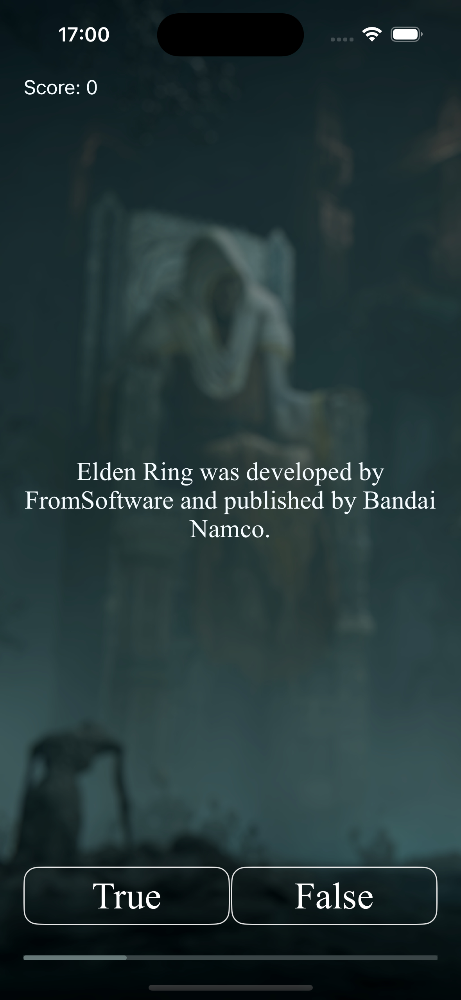

# Elden Ring Quiz

Welcome to **Elden Ring Quiz** – a simple iOS quiz app where you can test your knowledge about the popular video game *Elden Ring* through a series of true/false questions.

## Features

- **True/False Questions:** Answer a variety of true/false questions about *Elden Ring*.
- **User-Friendly Interface:** Designed with a clean and intuitive interface for an enjoyable quiz experience.
- **Instant Feedback:** Get immediate feedback on your answers as you progress through the quiz.

## Architecture

This project is built using the **Model-View-Controller (MVC)** architectural pattern, ensuring a clear separation of concerns and ease of maintenance.

- **Model:** Manages the data and business logic (e.g., the `Question` model representing each quiz question).
- **View:** The user interface components that display the questions and receive user input.
- **Controller:** Handles the interaction between the Model and View, updating the UI based on the user's input and the data from the Model.

## Technologies Used

- **Swift:** The programming language used to develop the app.
- **Xcode:** The IDE used for development.
- **MVC:** The architectural pattern implemented in the project.

## Installation

1. Clone the repository:
    ```bash
    git clone https://github.com/your-username/elden-ring-quiz.git
    ```
2. Open the project in Xcode:
    ```bash
    cd elden-ring-quiz
    open EldenRingQuiz.xcodeproj
    ```
3. Build and run the app on the iOS simulator or your iOS device.

## How to Play

1. Launch the app.
2. Answer the series of true/false questions.
3. Get your score at the end and see how well you know *Elden Ring*!

## License

This project is licensed under the MIT License - see the [LICENSE](LICENSE) file for details.

## Contact

For any inquiries or issues, feel free to reach out to me at [your-email@example.com].

## Screenshot


